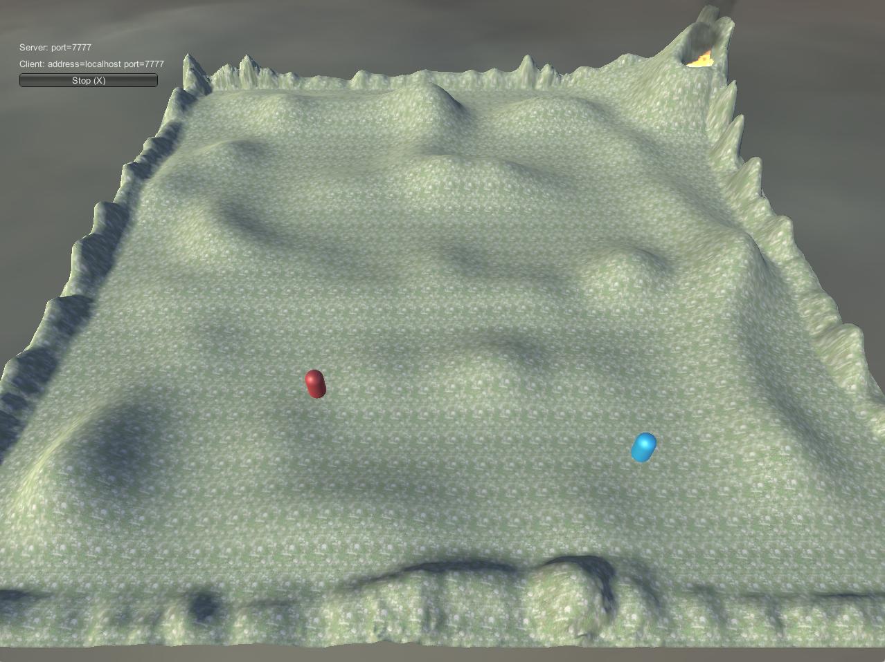

# unity-networking-demo

A super simple demo game to show the networking capabilities of Unity. 

Spawns a player for each client connected.

Pressing `space` the color of the players is changed, pressing `E` an explosion is triggered

## Slides of the talk

https://www.slideshare.net/JohnFrigo/moving-pixels-on-someone-elses-screen-introduction-to-unity-networking

## Contributors

- [Massimo Frasson](https://github.com/MaxFrax)
- [Giovanni Frigo](https://github.com/GiovanniFrigo)

## Built with

- Unity 2017.3.1f1 
- JetBrains Rider 2017.3.1
